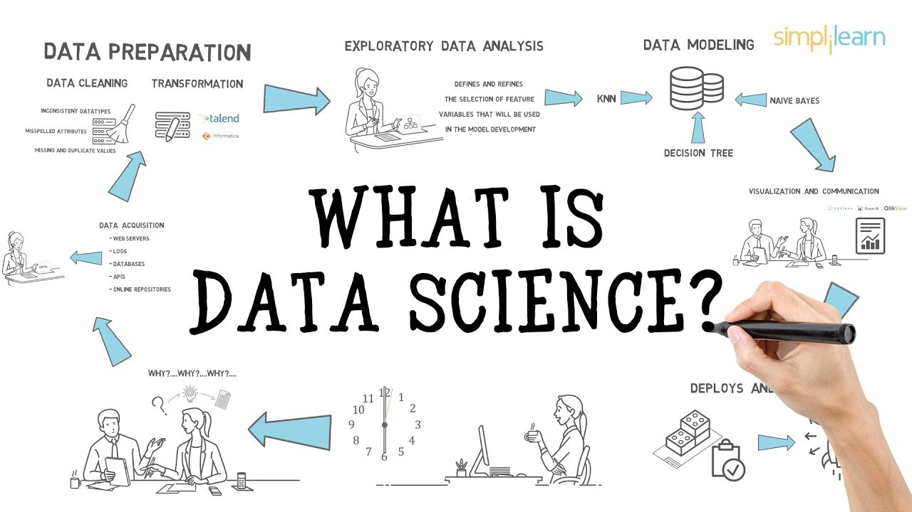
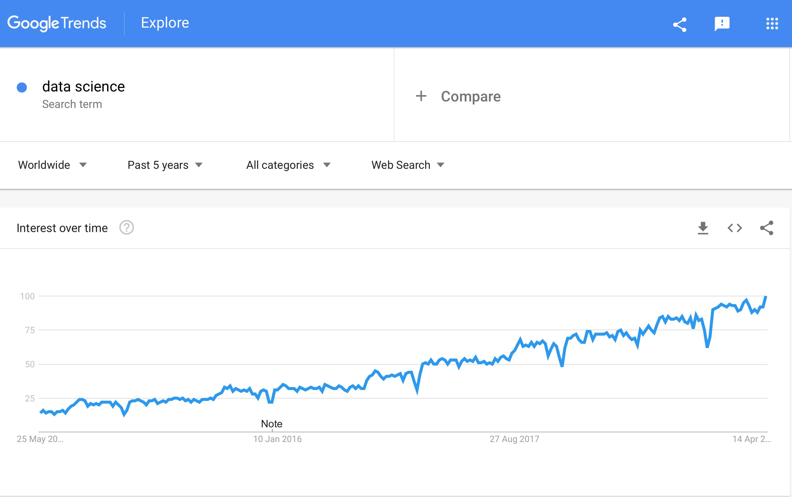

## Overview

- **STAT450: Case Studies in Statistics**
  - real case study
  
  - statistics & computational & communication

  
- **STAT550: Techniques for Statistical Consulting**
  - early involvement in Consulting
  
  - statistics & computational & communication
  - mentoring and/or supervisory role
  
- **A joint model: real consulting project**
  - gains
  
  - challenges

---
## STAT450: Case Studies in Statistics
**Learning Objectives:**

- understand how the data was collected 

- organize the data in a way that can be analyzed

- analyze the data using appropriate statistical methods 

- interpret the results 
- present and communicate the results

---
## STAT450: Case Studies  in Statistics
### Learning Objective

- understand how the data was collected 

- organize the data in a way that can be analyzed

- analyze the data using appropriate statistical methods 

- interpret the results 
- present and communicate the results

###Real Case Studies 
- from graduate students and research faculty in other disciplines

- from collaborators
- from agancies and units (inside and outside UBC)

---
## STAT450: (Real)  Case Studies  in Statistics
### Statistical Consulting Experience

 - understand how the data was collected 
 
 - understand how the data was collected 
 

- understand how the data was collected 

- organize the data in a way that can be analyzed

- analyze the data using appropriate statistical methods 

- interpret the results 
- present and communicate the results

---

## STAT450: (Real)  Case Studies  in Statistics
### Statistical Consulting Experience

 - **understand the "client's" question** 
 
 - **understand the context of the study**

- understand how the data was collected 

- organize the data in a way that can be analyzed

- analyze the data using appropriate statistical methods 

- interpret the results 

- **present and communicate the results**

- ###This process is NOT linear!!
---
## Most Statistics Programs

 - understand the "client's" question
 
 - understand the context of the study

- **understand how the data was collected** 

- organize the data in a way that can be analyzed

- **analyze the data using appropriate statistical methods** 

- interpret the results 

- present and communicate the results

---
## Challenge
 - Not all students are ready to handle a real analysis
 
  - Statistical methodology
 
  - Computational literacy
 
  - Communication skills

##Features of the course:

- to put in **real practice** the methodologies learned in the program 

- to learn new methodology as required by the goals of the study 

- to experience a **full** and **open-ended** data analysis process 

- to build collaborative relationships with peers

---
## Building a collaborative model
- Students work in groups of 2-4

- (If possible) each group works on a different case
- Each "client" meets with his/her group (at least) 3 times during the term:

  - **1st meeting**: introductions and presentation of case and data
  
  - **2nd meeting**: presentation of preliminary results
  
  - **3rd meeting**: poster session for presentation of final results

---
## Support: multiple  channels
- Each group is supervised by an instructor/TA

- Extra support to improve communication skills

- Many in-class and out-of-class discussions with the groups
- Weekly seminars to address statistical and computational challenges

## Is this enough??

- Probably not but expensive to get additional resourses

- Extremely time-consuming course for a single instructor 

- The progress of the case needs to match that of the term
---

### 
 from Professor Alison Gibbs, UT, Webinar 2012 

---
## STAT550: Techniques for Statistical Consulting

**Objectives**
  - promote an early involvement in statistical consulting
  
  - promote collaborative and interdisciplinary work
  
  - expose students to real data challenges
  - help students to  
    - use and sharpen their statistical and computational skills
    
    - to improve their communication skills

    - to build a portfolio for future reference

---

### 
 from Professor Alison Gibbs, UT, Webinar 2012 

---
## Our joint collaborative model

### STAT450: Case Studies in Statistics

### STAT550: Techniques for Statistical Consulting
- both classes work on a real data case study

- grad students mentor and supervised undergraduate students
- undergraduate students in-charge of most of the work 
---

## Is this DATA SCIENCE ?
---

## Is this DATA SCIENCE ?

---

### The worldwide interest in **Data Science** has been growing want in the past 5 years (Google Trends)
---
### We want to understand a **population** (e.g., gene behaviour) but we can only study a **random sample** from it.
### 
 Picture from Dr. Fowler, UW 

---

